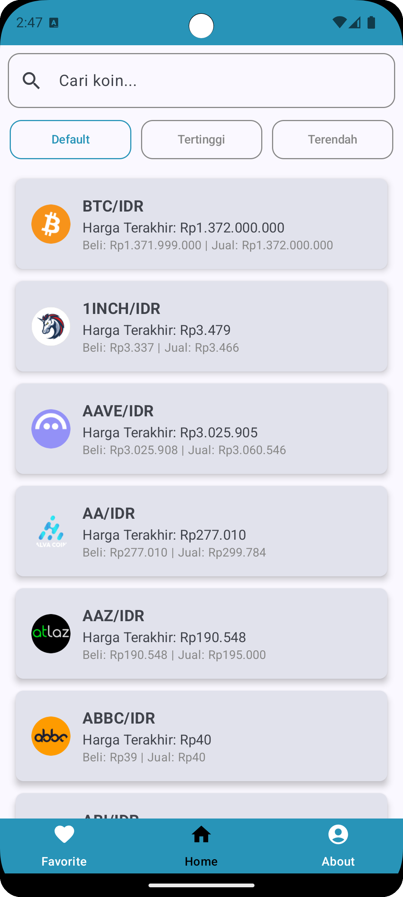
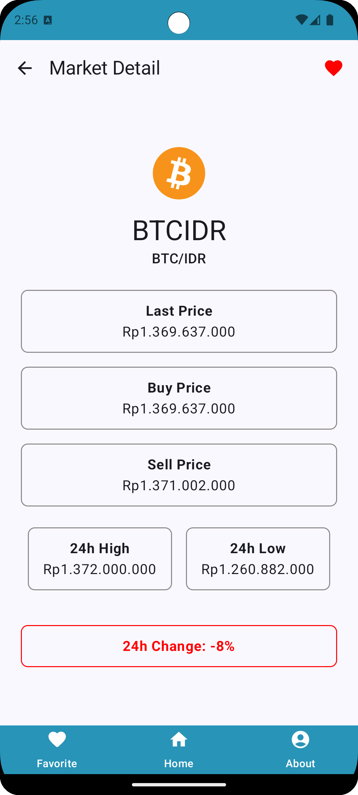
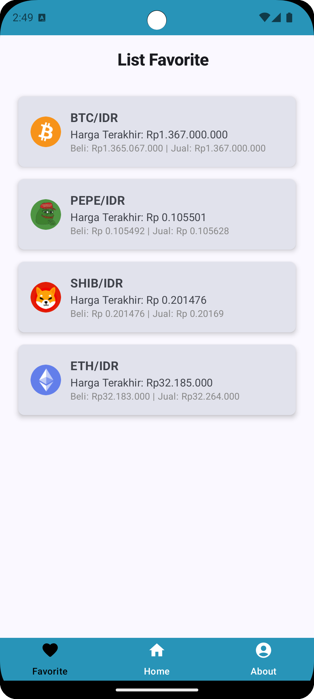

# Info Kripto App

Info Kripto App adalah aplikasi Android yang menyediakan informasi terkini tentang berbagai cryptocurrency. Aplikasi ini menampilkan daftar harga, perubahan nilai, serta detail lainnya untuk membantu pengguna dalam memantau pergerakan pasar aset kripto.

## 📱 Fitur Utama
- **Menampilkan daftar cryptocurrency** lengkap dengan harga dan perubahan nilai.
- **Detail Cryptocurrency**: Informasi lengkap tentang setiap koin, termasuk grafik harga.
- **Fitur Pencarian**: Memudahkan pengguna untuk mencari koin tertentu.
- **Favorit**: Simpan koin favorit untuk akses cepat.
- **Dark Mode**: Mendukung tampilan mode gelap dan terang.

## 🛠️ Teknologi yang Digunakan
- **Kotlin**: Bahasa pemrograman utama.
- **Jetpack Compose**: Untuk UI yang lebih modern dan deklaratif.
- **Retrofit**: Mengambil data dari API cryptocurrency.
- **Room Database**: Menyimpan daftar favorit pengguna.
- **ViewModel & LiveData**: Mengelola state aplikasi dengan arsitektur MVVM.
- **WorkManager**: Notifikasi pengingat tentang perubahan harga kripto.

## 📸 Tampilan Aplikasi
| Home | Detail | Favorite | About |
| ---- | ------ | -------- | ----- |
|    |  |  |  |

## 🚀 Cara Menjalankan
1. Clone repository ini:
   ```sh
   git clone https://github.com/username/info-kripto-app.git
   ```
2. Buka proyek di **Android Studio**.
3. Jalankan aplikasi menggunakan emulator atau perangkat fisik.

## 🔧 Dokumentasi API
   ```sh
   https://github.com/btcid/indodax-official-api-docs/blob/fffd794b4db1c238e7e07b7be60938a237db609c/Public-RestAPI.md
   ```
